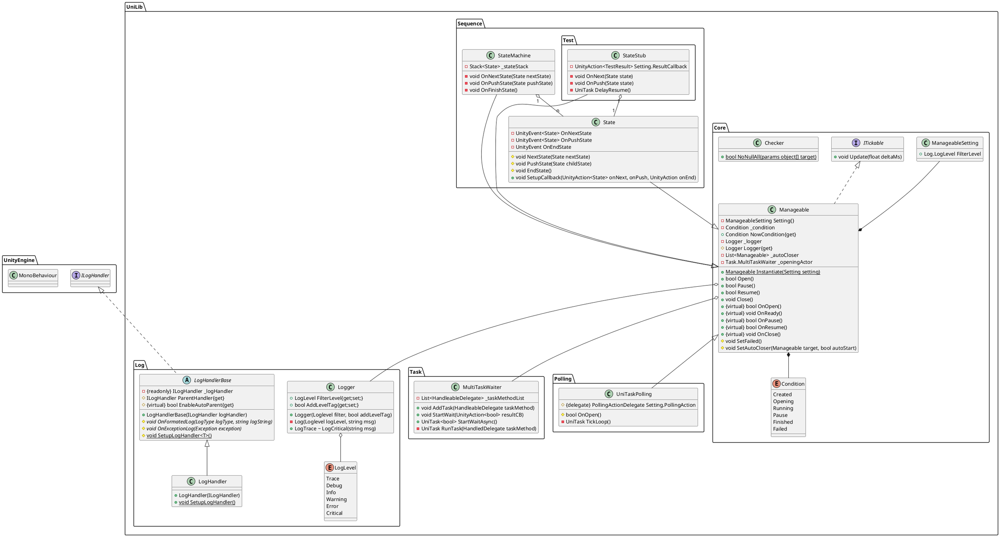

# unity_libs

```puml
@startuml class_map

package UnityEngine{
    interface ILogHandler
    class MonoBehaviour
}

package UniLib{

package Log{
    abstract LogHandlerBase{
        - {readonly} ILogHandler _logHandler
        # ILogHandler ParentHandler{get}
        # {virtual} bool EnableAutoParent{get}
        + LogHandlerBase(ILogHandler logHandler)
        # {abstract} void OnFormatedLog(LogType logType, string logString)
        # {abstract} void OnExceptionLog(Exception exception)
        # {static} void SetupLogHandler<T>()
    }
    ILogHandler <|.. LogHandlerBase

    class LogHandler{
        + LogHandler(ILogHandler)
        + {static} void SetupLogHandler()
    }
    LogHandlerBase <|-- LogHandler

    enum LogLevel{
        Trace
        Debug
        Info
        Warning
        Error
        Critical
    }
    class Logger{
        + LogLevel FilterLevel{get;set;}
        + bool AddLevelTag{get;set;}
        + Logger(Loglevel filter, bool addLevelTag)
        - Log(Loglevel logLevel, string msg)
        + LogTrace ~ LogCritical(string msg)
    }
    Logger o-- LogLevel
}

package Core{
    enum Condition{
        Created
        Opening
        Running
        Pause
        Finished
        Failed
    }

    class ManageableSetting{
        + Log.LogLevel FilterLevel
    }

    class Manageable{
        - ManageableSetting Setting{}
        - Condition _condition
        + Condition NowCondition{get}
        - Logger _logger
        # Logger Logger{get}
        - List<Manageable> _autoCloser
        - Task.MultiTaskWaiter _openingActor


        + {static} Manageable Instantiate(Setting setting)
        + bool Open()
        + bool Pause()
        + bool Resume()
        + void Close()
        + {virtual} bool OnOpen()
        + {virtual} void OnReady()
        + {virtual} bool OnPause()
        + {virtual} bool OnResume()
        + {virtual} void OnClose()
        # void SetFailed()
        # void SetAutoCloser(Manageable target, bool autoStart)
    }
    Manageable *-- Condition
    Manageable o-- Logger
    ManageableSetting --* Manageable
    ITickable <|.. Manageable
    Manageable o-- UniLib.Task.MultiTaskWaiter

    interface ITickable{
        + void Update(float deltaMs)
    }

    class Checker{
        + {static} bool NoNullAll(params object[] target)
    }
}

package Polling{
    class UniTaskPolling{
        # {delegate} PollingActionDelegate Setting.PollingAction
        # bool OnOpen()
        - UniTask TickLoop()
    }
    Manageable <|-- UniTaskPolling
}

package Task {
    class MultiTaskWaiter {
        - List<HandleableDelegate> _taskMethodList

        + void AddTask(HandleableDelegate taskMethod)
        + void StartWait(UnityAction<bool> resultCB)
        + UniTask<bool> StartWaitAsync()
        - UniTask RunTask(HandledDelegate taskMethod)
    }
}

package Sequence{
    class State{
        - UnityEvent<State> OnNextState
        - UnityEvent<State> OnPushState
        - UnityEvent OnEndState

        # void NextState(State nextState)
        # void PushState(State childState)
        # void EndState()
        + void SetupCallback(UnityAction<State> onNext, onPush, UnityAction onEnd)
    }
    State --|> Manageable

    class StateMachine{
        - Stack<State> _stateStack
        
        - void OnNextState(State nextState)
        - void OnPushState(State pushState)
        - void OnFinishState()
    }
    StateMachine --|> Manageable

    StateMachine "1" o-- "n" State

    package Test{
        class StateStub{
            - UnityAction<TestResult> Setting.ResultCallback
            - void OnNext(State state)
            - void OnPush(State state)
            - UniTask DelayResume()
        }
        StateStub --|> Manageable
        StateStub "1" o-- "1" State
    }
}


}
@enduml
```